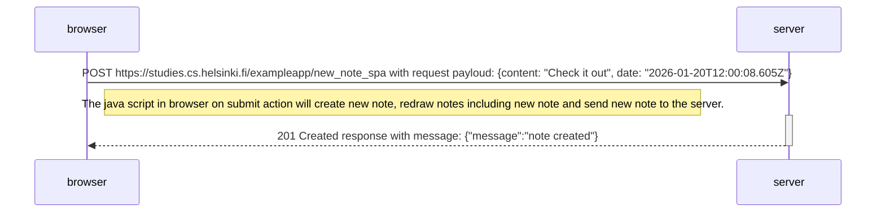

```mermaid
sequenceDiagram
    participant browser
    participant server

    browser->>server: POST https://studies.cs.helsinki.fi/exampleapp/new_note_spa with request payloud: {content: "Check it out", date: "2026-01-20T12:00:08.605Z"}
     Note right of browser: The java script in browser on submit action will create new note, redraw notes including new note and send new note to the server.
    activate server
    server-->>browser: 201 Created response with message: {"message":"note created"}
    deactivate server
```
